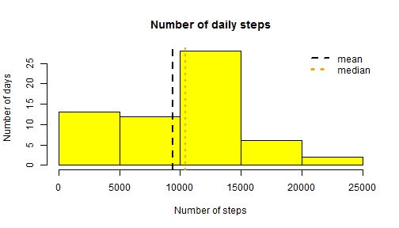
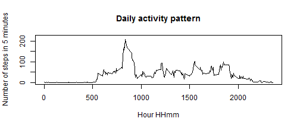
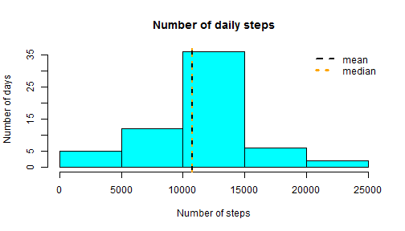
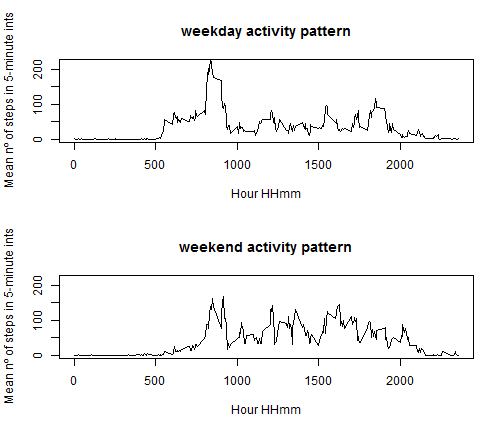

This data comes from a personal activity monitoring device, consisting of the number of steps taken by an individual during the months of October and November, 2012, at 5 minutes intervals. 

## Loading and preprocessing the data


   
## get data from files
The following code chunk loads the activity data into an R dataframe.  


```r
zipfile <- "activity.zip"
unzip(zipfile)
file <- list.files(pattern = ".csv")
activityData <- read.csv(file, na.strings = "NA")
```

## What is mean total number of steps taken per day?

 The following code produces a plot giving the days according to the number of steps taken that day.


```r
sumSteps <- tapply(activityData$steps, activityData$date, sum, na.rm=T)
NAS <- sum(is.na(tapply(activityData$steps, activityData$date, sum)))

hist(sumSteps, col= "yellow", main = "Number of daily steps", 
     xlab = "Number of steps", ylab = "Number of days")
abline(v=mean(sumSteps),lty=2,lwd=2)
abline(v=median(sumSteps), col="orange", lty=3, lwd=2)
legend("topright", bty="n", lty=c(2,3), lwd=c(2,3), col = c("black", "orange"), 
       legend = c("mean","median"))
```

 

```r
days     <- dim(sumSteps)
days_U5t <- dim(subset(sumSteps, sumSteps<5000))
days_0   <- dim(subset(sumSteps, sumSteps == 0))
mean1     <- format(mean(sumSteps), digits = 4, big.mark=" ")
median1   <- format(median(sumSteps), digits = 5, big.mark=" ")
```


According to the graph shown above, in 13 of the 61 days present in the dataset, the total number of daily steps taken by the subject was lower than 5000.  This figure includes 8 days for which no data is given (for all other days the observations are complete, as NAS comes equal to days_0). The average daily number of steps in this dataset is 9 354 steps, and the median is 10 395 steps. The later figures also include days for each no data is given (assumed as 0).  


```r
mean1   <- format(mean(subset(sumSteps, sumSteps != 0)), digits = 5, big.mark=" ")
median1 <- format(median(subset(sumSteps, sumSteps != 0)), digits = 5, big.mark=" ")
```

If we ignore the days for which no data is given, the average number of daily steps climbs up to 10 766, and the median becomes 10 765 steps.  In this last case, the mean and the median are almost the same.

## What is the average daily activity pattern?

The following plots the average daily activity pattern, i.e. the distribution of the number of steps taken throughout the day, in five minutes intervals.


```r
intervalSteps <- tapply(activityData$steps, activityData$interval, 
                        mean, na.rm = TRUE)

plot(x=unique(activityData$interval), y=intervalSteps, type="l", 
     main = "Daily activity pattern",  xlab = "Hour HHmm", 
     ylab ="Number of steps in 5 minutes", ylim=c(0,220))
```

 

```r
maxHour <- format(activityData$interval[which.max(intervalSteps)]/100, 
                          decimal.mark=":")
maxSteps <- format(intervalSteps[which.max(intervalSteps)], digits = 3)
```

The subject's daily pattern for walking shows that he runned a diurnal life during the two month's sample, with the majority of walking activity occurring between 6:00 and 20:00.

The period with the largest walking activity is 8:35, with an average number of 206 steps.


## Imputing missing values


```r
dataNA <- is.na(activityData$steps)
totalNA <- sum(dataNA)
missing <- subset(activityData, dataNA)
dateNA <- unique(missing$date)
```
The variable NAS, already computed in the second code chunk, gives the number of days with missing values (8 days). Indeed, there are 2304 observations with missing values in this dataset. The days with missing values are 2012-10-01, 2012-10-08, 2012-11-01, 2012-11-04, 2012-11-09, 2012-11-10, 2012-11-14, 2012-11-30.

The following code chunk copy the activity dataset to a new dataset and fills the missing data with the sample's 5-minute averages.


```r
filledData <- activityData
for(j in dateNA) {
        for(i in 1:288) {
                filledData[filledData$date == j,]$steps[i] <- intervalSteps[i]
                }
}
```

The following plots replicates the previous one with this new dataset (no missing data).


```r
filledSteps <- tapply(filledData$steps, filledData$date, sum)

hist(filledSteps, col= "cyan", main = "Number of daily steps", 
     xlab = "Number of steps", ylab = "Number of days")
abline(v=mean(filledSteps),lty=2,lwd=2)
abline(v=median(filledSteps), col="orange", lty=3, lwd=2)
legend("topright", bty="n", lty=c(2,3), lwd=c(2,3), col = c("black", "orange"), 
       legend = c("mean","median"))
```

 

```r
mean2     <- format(mean(filledSteps), digits = 5, big.mark=" ")
median2   <- format(median(filledSteps), digits = 5, big.mark=" ")
```

The average daily number of steps in this dataset is now 10 766 steps, and the median is also 10 766 steps.  


## Are there differences in activity patterns between weekdays and weekends?

The next code chunk classifies and segments weekdays from weekend days.


```r
Sys.setlocale("LC_TIME", "C") # your LOCAL TIME -> English
```

```
## [1] "C"
```

```r
filledData$dayOfWeek <- "weekday"
filledData$dayOfWeek <- factor(filledData$dayOfWeek, levels = c("weekday", "weekend"))

filledData$day <- weekdays(as.POSIXct(filledData$date), abbreviate = F)
filledData[filledData$day == "Saturday",]$dayOfWeek <- "weekend"
filledData[filledData$day == "Sunday",]$dayOfWeek <- "weekend"
```

Finally, we can plot both time series to highlight any differences between activity patterns on weekdays and wekends.


```r
par(mfrow=c(2,1))

split1 <- split(filledData,filledData$dayOfWeek)
for (i in 1:2) {
       tempDF <- split1[[i]] 
       sname  <- names(split1)[i]
       dSteps <- tapply(tempDF$steps, tempDF$interval, mean)
       
       plot(x=unique(tempDF$interval), y=dSteps, type="l",
            main = paste(sname,"activity pattern"),  xlab = "Hour HHmm",
            ylab ="Mean nº of steps in 5-minute ints", ylim = c(0,220))
}
```

 
